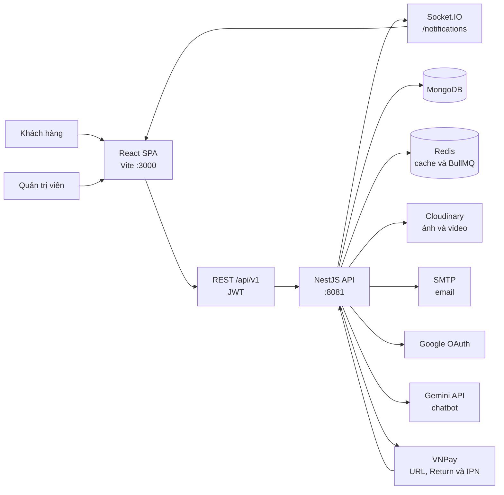
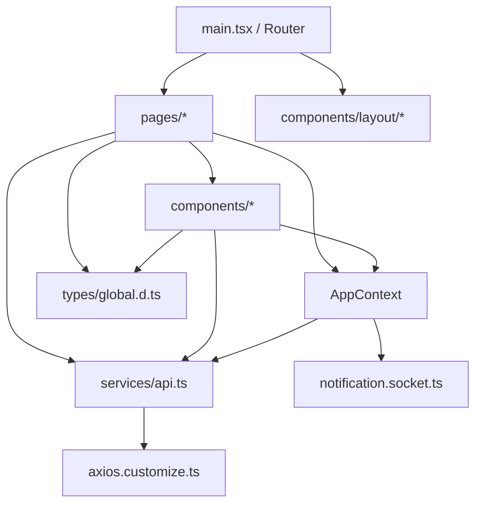
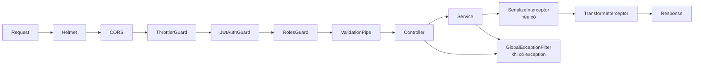
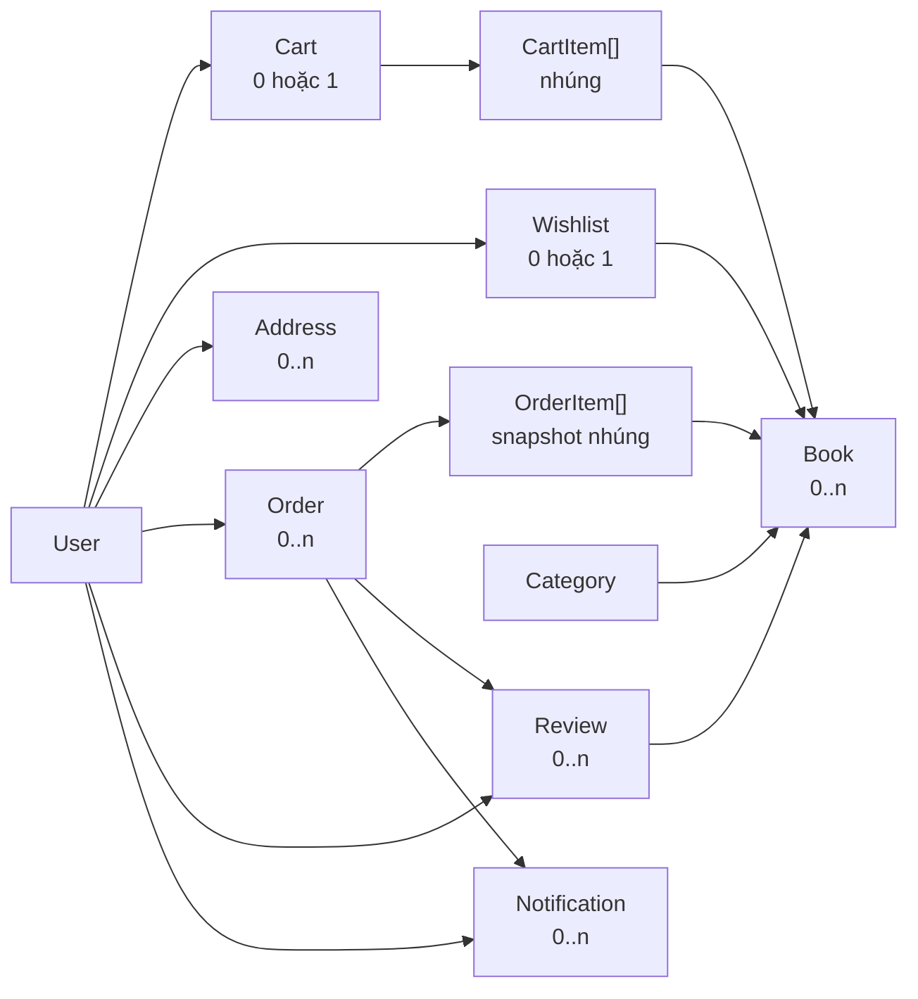
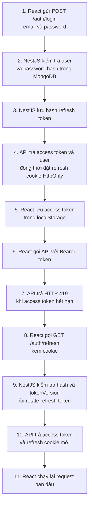
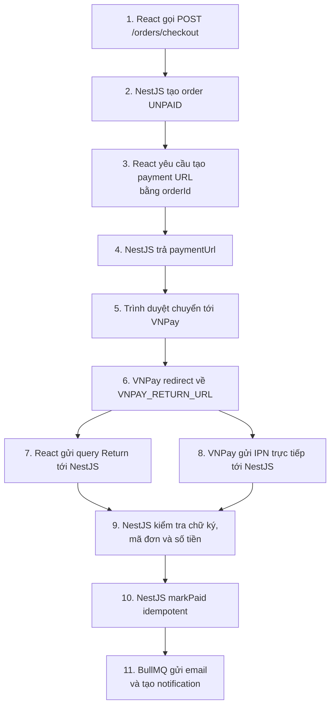

# Kiến trúc hệ thống BookStore

Tài liệu này mô tả kiến trúc **hiện tại (as-is)** được đối chiếu trực tiếp từ hai thư mục:

- `01-react-vite-starter`: ứng dụng web React dành cho khách hàng và quản trị viên.
- `backend-for-react-ts`: REST API, WebSocket gateway và background workers viết bằng NestJS.

Các phần chưa đồng bộ giữa frontend và backend được ghi riêng ở mục [Các điểm lệch và rủi ro hiện tại](#11-các-điểm-lệch-và-rủi-ro-hiện-tại); chúng không được xem là chức năng hoàn chỉnh.

## 1. Tổng quan hệ thống

BookStore được triển khai theo mô hình client-server. Frontend là một Single Page Application (SPA), backend là một NestJS modular monolith. Backend kết nối MongoDB để lưu dữ liệu nghiệp vụ, Redis để cache và vận hành BullMQ, đồng thời tích hợp một số dịch vụ bên ngoài.



### Đặc điểm kiến trúc chính

- Hai ứng dụng độc lập, mỗi ứng dụng có `package.json`, lockfile, lệnh build và biến môi trường riêng.
- Không có package/workspace chung và chưa chia sẻ type giữa frontend với backend.
- Backend là modular monolith: REST API, Socket.IO gateway và BullMQ workers cùng chạy trong một tiến trình NestJS.
- Giao tiếp đồng bộ dùng HTTP/JSON; cập nhật thời gian thực dùng Socket.IO; email và tạo thông báo nghiệp vụ dùng hàng đợi BullMQ.
- API có global prefix `api` và URI versioning; frontend hiện gọi phiên bản `/api/v1`.

## 2. Cấu trúc mã nguồn

```text
BookStore - Reactjs/
├── 01-react-vite-starter/          # Frontend React/Vite
│   ├── public/                     # Tài nguyên tĩnh
│   ├── docs/                       # Ghi chú và checklist frontend
│   ├── src/
│   │   ├── assets/                 # Ảnh dùng trong bundle
│   │   ├── components/
│   │   │   ├── admin/              # Bảng, form, modal quản trị
│   │   │   ├── auth/               # Route guard phía client
│   │   │   ├── context/            # AppContext
│   │   │   ├── layout/             # Header, admin layout, mobile nav, chatbot
│   │   │   ├── notification/       # UI thông báo
│   │   │   └── share/              # Component dùng chung
│   │   ├── pages/
│   │   │   ├── admin/              # Dashboard và màn hình quản trị
│   │   │   └── client/             # Trang mua hàng và tài khoản
│   │   ├── services/               # Axios, API facade, Socket.IO
│   │   ├── styles/                 # SCSS toàn cục
│   │   ├── types/                  # Kiểu dữ liệu toàn cục và Axios
│   │   ├── utils/                  # Navigation, recently viewed
│   │   ├── main.tsx                # Bootstrap, provider và router
│   │   └── layout.tsx              # Layout phía khách hàng
│   └── vite.config.ts
└── backend-for-react-ts/           # Backend NestJS
    ├── AGENTS.md                   # Điều hướng Codex tới docs/source liên quan
    ├── docs/
    │   ├── ARCHITECTURE.md         # Tài liệu này
    │   ├── API-GUIDE.md            # Contract API hiện tại
    │   ├── DATA-SCHEMA.md          # Schema, invariant và transaction
    │   └── TESTING.md              # Unit, contract, smoke và integration test
    ├── src/
    │   ├── common/                 # Decorator, guard metadata, filter, interceptor, helper
    │   ├── databases/              # Kết nối/seed dữ liệu mẫu
    │   ├── modules/                # Các bounded module nghiệp vụ
    │   ├── types/                  # Type toàn cục backend
    │   ├── app.module.ts            # Composition root
    │   └── main.ts                  # Bootstrap HTTP server
    ├── test/                       # Cấu hình và e2e test
    ├── NestJS for React.postman_collection.json
    └── nest-cli.json
```

## 3. Kiến trúc frontend

### 3.1 Công nghệ và bootstrap

Frontend sử dụng React 18, TypeScript, Vite 5, React Router 6, Ant Design 5, Axios, SCSS và `socket.io-client`.

`src/main.tsx` thực hiện các bước khởi tạo:

1. Cấu hình locale tiếng Việt cho Ant Design và Day.js.
2. Khai báo toàn bộ route bằng `createBrowserRouter`.
3. Bọc ứng dụng trong `ConfigProvider`, Ant Design `App` và `AppProvider`.
4. Render `RouterProvider` vào phần tử `#root`.

Alias import như `@/*`, `pages/*`, `components/*`, `services/*` được khai báo trong `tsconfig.app.json` và nạp bởi `vite-tsconfig-paths`.

### 3.2 Route và layout

| Nhóm | Route chính | Bảo vệ phía client |
| --- | --- | --- |
| Công khai | `/`, `/book`, `/book/:id`, `/about`, `/login`, `/register`, `/verify/:id`, `/payment/vnpay-return` | Không |
| Tài khoản/mua hàng | `/profile`, `/cart`, `/checkout`, `/notifications`, `/orders`, `/orders/history`, `/orders/:id` | `ProtectedRoute` yêu cầu đăng nhập |
| Wishlist | `/wishlist` | Hiện không bọc `ProtectedRoute` |
| Quản trị | `/admin`, `/admin/book`, `/admin/book/:id`, `/admin/category`, `/admin/order`, `/admin/user`, `/admin/user/:id`, `/admin/voucher` | Từng route con dùng `ProtectedRoute`; route chứa `admin` từ chối role `USER` |

`src/layout.tsx` là layout phía khách hàng, gồm header, nội dung route (`Outlet`), chatbot và thanh điều hướng mobile. `components/layout/layout.admin.tsx` cung cấp sidebar/header/breadcrumb cho khu vực quản trị.

Route guard phía frontend chỉ phục vụ trải nghiệm người dùng. Quyền truy cập thật sự vẫn phải do JWT guard và role guard của backend quyết định.

### 3.3 State phía client

`AppProvider` là global state nhẹ dựa trên React Context, quản lý:

- trạng thái đăng nhập và người dùng hiện tại;
- trạng thái khởi tạo ứng dụng;
- các item trong giỏ hàng;
- dữ liệu và danh sách ID sách trong wishlist.

Khi ứng dụng khởi động, provider:

1. Nhận access token từ query string nếu người dùng vừa quay lại từ Google OAuth.
2. Gọi `/auth/account` để phục hồi phiên.
3. Nếu hợp lệ, tải giỏ hàng và wishlist song song.
4. Kết nối namespace Socket.IO `/notifications`.

State theo màn hình, form, phân trang và bộ lọc được giữ cục bộ trong page/component. Lịch sử sách vừa xem được lưu trong `localStorage` qua `utils/recentlyViewed.ts`.

### 3.4 Lớp giao tiếp backend

`services/axios.customize.ts` tạo một Axios instance với:

- `baseURL = VITE_BACKEND_URL + /api/v1`;
- `withCredentials: true` để gửi refresh-token cookie;
- request interceptor gắn `Authorization: Bearer <access_token>` từ `localStorage`;
- response interceptor bóc `res.data`;
- cơ chế single-flight refresh: khi nhiều request cùng nhận HTTP `419`, chỉ một request gọi `/auth/refresh`, các request còn lại chờ trong hàng đợi rồi được chạy lại.

`services/api.ts` là API facade tập trung cho auth, user, book, category, file, cart, order, payment, history, dashboard, review, location, notification, chatbot, voucher và wishlist.

`services/notification.socket.ts` duy trì một Socket.IO singleton. Các message từ server được chuyển thành browser `CustomEvent`:

- `notifications:unread-count`;
- `admin:order:new`;
- `admin:order:updated`.

Cách này giúp các component lắng nghe realtime mà không phải giữ socket trong từng component.

### 3.5 Hướng phụ thuộc frontend



Không có store chuyên dụng, repository layer hoặc data-fetching cache phía frontend. Page/component gọi API facade trực tiếp.

## 4. Kiến trúc backend

### 4.1 Bootstrap và request pipeline

`src/main.ts` khởi tạo NestJS/Express và cấu hình request pipeline theo thứ tự khái quát:



Cấu hình toàn cục quan trọng:

- Helmet security headers và CORS có credentials.
- Rate limit mặc định 60 request/phút; một số endpoint auth/checkout/payment có hạn mức thấp hơn.
- JWT và role guard áp dụng mặc định; endpoint công khai phải có `@Public()`.
- `ValidationPipe` bật `whitelist`, `forbidNonWhitelisted` và `transform`.
- Prefix `api`, URI versioning mặc định cho version `1` và `2`.
- Swagger được cấu hình tại đường dẫn `/swagger`.
- Thư mục `public` được phục vụ như static assets.

### 4.2 Response contract

Request thành công được `TransformInterceptor` chuẩn hóa:

```json
{
  "statusCode": 200,
  "message": "Thông báo theo endpoint",
  "data": {}
}
```

Lỗi được `GlobalExceptionFilter` trả về:

```json
{
  "error": {
    "timestamp": "2026-07-17T00:00:00.000Z",
    "path": "/api/v1/...",
    "statusCode": 400,
    "message": "Nội dung lỗi hoặc mảng lỗi validation"
  }
}
```

Các controller có thể dùng `@Serialize(Dto)` để loại thuộc tính nhạy cảm và chuyển model sang response DTO trước khi response được bọc vào envelope.

### 4.3 Các module nghiệp vụ

| Module | Trách nhiệm chính |
| --- | --- |
| `auth` | Local login, Google OAuth, JWT access/refresh, verify email, đổi/quên/reset mật khẩu |
| `users` | Tài khoản, profile, quản trị người dùng, gửi job email đăng ký/reset |
| `books` | Catalog sách, tìm kiếm/lọc/phân trang, tồn kho, cache invalidation |
| `categories` | CRUD danh mục, slug, soft delete/restore |
| `carts` | Một giỏ hàng cho mỗi user, item/quantity/tổng tiền |
| `orders` | Checkout, lịch sử trạng thái, hủy đơn, cập nhật tồn kho, đánh dấu đã thanh toán |
| `history` | Danh sách và chi tiết đơn hàng thuộc người dùng |
| `payments` | Tạo URL, xác minh Return và IPN của VNPay |
| `reviews` | Review theo đơn đã hoàn tất, media, helpful, tổng hợp rating vào sách |
| `wishlists` | Một wishlist cho mỗi user, thêm/xóa sách |
| `addresses` | CRUD sổ địa chỉ và địa chỉ mặc định của user |
| `locations` | Danh sách tỉnh/phường từ dữ liệu Việt Nam đóng gói trong source |
| `files` | Upload/delete file, tích hợp Cloudinary cho avatar/book/review |
| `notifications` | Lưu thông báo, unread count, BullMQ processor và Socket.IO gateway |
| `mail` | SMTP, Handlebars templates và BullMQ mail processor |
| `dashboard` | Số liệu tổng quan, đơn mới, sách bán chạy và biểu đồ doanh thu cho admin |
| `chatbot` | Lấy dữ liệu sách và gọi Gemini để trả lời người dùng |
| `databases` | Seed user/category/book khi `SHOULD_INIT` được bật |

Backend hiện **không có** module voucher dù frontend đã khai báo UI và API cho chức năng này.

### 4.4 Tầng dữ liệu

Mongoose kết nối MongoDB từ `MONGODB_URL`. Plugin `mongoose-delete` được đăng ký trên connection để bổ sung soft delete, `deletedAt`, `deletedBy` và override các method truy vấn.



Các document chính:

| Collection/model | Dữ liệu đáng chú ý |
| --- | --- |
| `User` | profile, role `USER/ADMIN`, loại tài khoản `LOCAL/GOOGLE`, trạng thái active, token reset/verify, hash refresh token, `tokenVersion` |
| `Book` | ảnh, tên, tác giả, giá, tồn kho, đã bán, category, average rating và rating summary |
| `Category` | name, unique slug, description |
| `Cart` | unique `userId`, embedded items, tổng số lượng và tổng tiền |
| `Wishlist` | unique `userId`, mảng `bookIds` |
| `Address` | người nhận, tỉnh/phường, địa chỉ đầy đủ, cờ mặc định |
| `Order` | unique order code, user, embedded item snapshot, shipping snapshot, tổng tiền, trạng thái đơn/thanh toán |
| `Review` | user, book, order, rating, comment, media, danh sách user đánh dấu hữu ích |
| `Notification` | user, nội dung, loại, order liên quan, trạng thái đã đọc |

`OrderItem` giữ snapshot tên sách, ảnh và giá tại thời điểm đặt hàng. Vì vậy lịch sử đơn không phụ thuộc hoàn toàn vào dữ liệu sách có thể thay đổi sau đó.

## 5. Xác thực và phân quyền

### 5.1 Local login và refresh token



- Access token được frontend lưu trong `localStorage` và gửi qua Bearer header.
- Refresh token là JWT trong HttpOnly cookie; backend chỉ lưu bản hash.
- Refresh thực hiện rotation và phát hiện token cũ bị dùng lại.
- `tokenVersion` vô hiệu hóa các token đã cấp sau logout, đổi hoặc reset mật khẩu.
- `RolesGuard` đọc metadata `@Roles(...)`; các API quản trị dùng role `ADMIN`.
- Google OAuth callback hiện chuyển hướng về frontend với access token trong query string; `AppProvider` lấy token rồi xóa query khỏi URL.

## 6. Luồng đặt hàng và thanh toán

### 6.1 Checkout

Checkout chạy trong MongoDB transaction:

1. Đọc và populate giỏ hàng của user.
2. Chọn toàn bộ hoặc các item trong `selectedBookIds`.
3. Với từng sách, dùng conditional update `quantity >= số lượng mua` để tránh bán vượt tồn kho.
4. Giảm `quantity`, tăng `sold`, đồng thời tạo snapshot `OrderItem`.
5. Tạo order trạng thái `PENDING`, thanh toán `UNPAID`.
6. Chỉ xóa các item đã checkout khỏi cart và tính lại tổng.
7. Commit transaction, xóa cache và phát `admin:order:new` qua Socket.IO.
8. Nếu có lỗi, abort transaction để rollback order, cart và tồn kho.

Vì có transaction nhiều document, MongoDB local phải chạy dưới dạng replica set (hoặc dùng MongoDB Atlas); MongoDB standalone không đáp ứng luồng này.

### 6.2 Vòng đời đơn hàng

Trạng thái hợp lệ được backend kiểm soát trong `OrdersService`:

```text
PENDING -> CONFIRMED -> SHIPPING -> COMPLETED
   |          |
   v          v
CANCELLED  CANCELLED
```

User chỉ được tự hủy đơn `PENDING`; admin có thể chuyển đơn `PENDING` hoặc `CONFIRMED` sang `CANCELLED`. Khi hủy đơn, service hoàn kho trong transaction. Khi admin cập nhật trạng thái, backend phát realtime cho admin và đưa job email/thông báo vào BullMQ.

### 6.3 VNPay



`vnpayReturn` phục vụ trải nghiệm sau redirect, còn IPN phải là nguồn xác nhận server-to-server tin cậy. Cả hai nhánh kiểm tra chữ ký, order code, amount và chỉ cập nhật khi đơn chưa `PAID`.

## 7. Realtime và xử lý bất đồng bộ

### 7.1 Socket.IO

Gateway chạy ở namespace `/notifications` và xác thực access token từ Socket.IO handshake.

- Mỗi user tham gia room `user:<userId>`.
- Admin tham gia thêm room `admin:orders`.
- Sự kiện user: `notification:new`, `notification:unread-count`.
- Sự kiện admin: `admin:order:new`, `admin:order:updated`.

Socket chỉ đảm nhiệm tín hiệu realtime. Dữ liệu thông báo vẫn được lưu trong MongoDB và có REST API để tải lại, phân trang, đánh dấu đã đọc.

### 7.2 Redis, cache và BullMQ

Backend dùng hai mục đích Redis:

- `REDIS_URL`: cache thông qua Keyv/Cache Manager.
- `REDIS_QUEUE_URL`: connection của BullMQ cho `mail-queue` và `notification-queue`.

BullMQ mặc định retry tối đa 3 lần với exponential backoff 3 giây. Job thành công bị xóa; job lỗi được giữ lại.

| Queue | Producer | Processor | Công việc |
| --- | --- | --- | --- |
| `mail-queue` | Users/Orders service | `MailProcessor` | Xác thực email, reset mật khẩu, đổi trạng thái đơn, thanh toán thành công |
| `notification-queue` | Orders service | `NotificationsProcessor` | Tạo thông báo trạng thái đơn và thanh toán thành công |

Books, categories, reviews và orders hiện invalidation cache bằng `cacheManager.clear()`, tức xóa toàn bộ cache thay vì theo key/module.

## 8. Tích hợp bên ngoài

| Hệ thống | Điểm tích hợp | Mục đích |
| --- | --- | --- |
| MongoDB | Mongoose | Dữ liệu nghiệp vụ, soft delete, transaction |
| Redis | Keyv + BullMQ | Cache, queue, retry job |
| Cloudinary | `FilesModule`, seed utility | Avatar, ảnh sách, media review |
| SMTP | Nest Mailer + Handlebars | Email xác thực/reset/order/payment |
| Google OAuth | Passport Google | Đăng nhập Google |
| VNPay | `nestjs-vnpay`/`vnpay` | Thanh toán online |
| Gemini | `@google/generative-ai` | Chatbot tư vấn dựa trên catalog sách |

Dữ liệu tỉnh/phường không gọi dịch vụ bên ngoài; nó được lấy từ `src/modules/locations/data/vietnam-addresses.ts`.

## 9. Cấu hình và vận hành

### 9.1 Frontend

Biến môi trường bắt buộc:

| Biến | Vai trò |
| --- | --- |
| `VITE_BACKEND_URL` | Origin backend, ví dụ `http://localhost:8081`; Axios tự nối `/api/v1` |

Chạy local:

```bash
cd 01-react-vite-starter
npm install
npm run dev
```

Frontend mặc định chạy cổng `3000`. Build production dùng `npm run build` và tạo bundle Vite trong `dist/`.

### 9.2 Backend

Các nhóm biến môi trường:

| Nhóm | Biến chính |
| --- | --- |
| Server/URL | `PORT`, `CLIENT_URL`, `SERVER_URL` |
| Database | `MONGODB_URL`, `SHOULD_INIT`, `INIT_PASSWORD` |
| Redis | `REDIS_URL`, `REDIS_CACHE_TTL`, `REDIS_QUEUE_URL` |
| JWT | `JWT_ACCESS_SECRET`, `JWT_ACCESS_EXPIRE`, `JWT_REFRESH_SECRET`, `JWT_REFRESH_EXPIRE` |
| Mail | `MAIL_HOST`, `MAIL_PORT`, `MAIL_USER`, `MAIL_PASS` |
| Google | `GOOGLE_CLIENT_ID`, `GOOGLE_SECRET`, `GOOGLE_REDIRECT_URL` |
| VNPay | `VNPAY_TMN_CODE`, `VNPAY_SECURE_SECRET`, `VNPAY_URL`, `VNPAY_RETURN_URL`, `VNPAY_IPN_URL`, `VNPAY_TEST_MODE` |
| Cloudinary | cloud name/key/secret, folder theo media, `CLOUDINARY_SEED_IMAGE_ROOT`, `CLOUDINARY_SEED_BASE_URL` |
| Chatbot | `GEMINI_API_KEY` |

Chạy local:

```bash
cd backend-for-react-ts
pnpm install --frozen-lockfile
pnpm dev
```

Backend mặc định chạy cổng `8081`. Cần khởi động MongoDB và Redis trước backend. Nếu bật `SHOULD_INIT`, backend seed user/category/book lúc module khởi tạo. Ảnh seed có thể lấy từ thư mục local qua `CLOUDINARY_SEED_IMAGE_ROOT` hoặc từ URL public qua `CLOUDINARY_SEED_BASE_URL`.

Backend dùng pnpm làm package manager chuẩn; phiên bản được khai báo trong trường `packageManager` của `package.json` và dependency tree được khóa bởi `pnpm-lock.yaml`.

### 9.3 Topology triển khai hiện tại

Tối thiểu cần các tiến trình/dịch vụ:

```text
[Static frontend hoặc Vite preview]
                |
                v
[Một NestJS process: HTTP + Socket.IO + BullMQ workers]
        |                         |
        v                         v
   [MongoDB replica set]       [Redis]
```

Repo chưa có Dockerfile, Docker Compose, reverse-proxy config hay CI/CD manifest. Những phần này nằm ngoài kiến trúc được triển khai trong source hiện tại.

## 10. Quy ước mở rộng

### Thêm tính năng frontend

1. Thêm type vào `src/types` hoặc type cục bộ sát feature.
2. Thêm hàm gọi API vào `src/services/api.ts`.
3. Tạo page/component theo khu vực `client` hoặc `admin`.
4. Khai báo route trong `src/main.tsx` và bọc `ProtectedRoute` nếu cần.
5. Nếu có realtime, thêm listener tập trung trong `notification.socket.ts` rồi phát `CustomEvent` cho UI.

### Thêm module backend

1. Tạo module/controller/service và DTO validation trong `src/modules/<feature>`.
2. Thêm Mongoose schema nếu feature có persistence.
3. Import module vào `AppModule`.
4. Đánh dấu `@Public()` một cách tường minh hoặc dùng JWT mặc định; thêm `@Roles(UserRoles.ADMIN)` cho API quản trị.
5. Giữ response envelope chung và dùng response DTO cho dữ liệu nhạy cảm.
6. Dùng BullMQ cho tác vụ không cần hoàn tất trong request; dùng Socket.IO cho tín hiệu realtime.
7. Cập nhật đồng thời type/API facade phía frontend để tránh contract drift.

## 11. Các điểm lệch và rủi ro hiện tại

Đây là các vấn đề quan sát được trực tiếp từ source, cần xử lý trước khi xem hệ thống là production-ready.

### Mức ưu tiên cao

1. **Voucher chỉ tồn tại ở frontend.** Frontend gọi `/vouchers/*`, có route quản trị và gửi `voucherCode` khi checkout, nhưng backend không có `VouchersModule`, schema hay controller.
2. **Checkout có voucher sẽ bị validation từ chối.** `CheckoutDto` backend không khai báo `voucherCode`; global `ValidationPipe` bật `forbidNonWhitelisted`, nên payload có trường này sẽ nhận HTTP 400. `Order` backend cũng chưa có `voucherCode`/discount fields dù frontend đã đọc các trường đó.
3. **VNPay Return và IPN đang bị JWT guard bảo vệ.** `PaymentsController` không đánh dấu hai endpoint bằng `@Public()`, trong khi JWT guard áp dụng toàn cục. Đặc biệt VNPay IPN là callback server-to-server nên không thể cung cấp access token của user.
4. **Contract lỗi Axios không nhất quán.** Với lỗi khác `419`, response interceptor trả `error.response.data` như một Promise thành công thay vì `Promise.reject`. Vì vậy một số `catch` ở page/component sẽ không chạy và code phải tự phân biệt response thành công/lỗi.

### Mức ưu tiên trung bình

5. **Wishlist route không được bảo vệ ở frontend.** `/wishlist` không bọc `ProtectedRoute`, trong khi REST API wishlist cần JWT theo cơ chế guard mặc định.
6. **Google OAuth đưa access token vào URL.** Query string có thể xuất hiện trong history, log hoặc telemetry trước khi `AppProvider` xóa nó. Một cơ chế one-time code hoặc cookie an toàn sẽ giảm rủi ro lộ token.
7. **Cookie production chưa được harden trong code.** Refresh cookie mới đặt `httpOnly` và `maxAge`, chưa cấu hình rõ `secure`, `sameSite`, `domain` theo môi trường.
8. **CORS WebSocket rộng hơn CORS HTTP.** HTTP chỉ chấp nhận `CLIENT_URL` và localhost, nhưng Socket.IO gateway dùng `origin: true`.
9. **Cache invalidation quá rộng.** Nhiều mutation gọi `cacheManager.clear()`, có thể làm giảm hiệu quả Redis khi dữ liệu và lưu lượng tăng.

### Chất lượng và kiểm thử

10. Frontend chưa có test runner hoặc file test trong source hiện tại.
11. Backend đã có unit/contract tests cho utility, token, exception/response envelope và checkout DTO, cùng HTTP smoke test cho `GET /api/v1/health`. Tuy vậy, các service nghiệp vụ chính và luồng MongoDB transaction chưa có integration test với hạ tầng test thực; chiến lược mở rộng được mô tả trong [TESTING.md](./TESTING.md).
12. Frontend và backend duy trì model/DTO riêng, không có schema hoặc generated client làm nguồn contract duy nhất; voucher là ví dụ rõ nhất của contract drift.

## 12. Nguồn sự thật trong code

Khi tài liệu và code khác nhau, ưu tiên các file sau:

- Route frontend: `01-react-vite-starter/src/main.tsx`.
- State phiên/giỏ hàng/wishlist: `01-react-vite-starter/src/components/context/app.context.tsx`.
- HTTP client và refresh flow: `01-react-vite-starter/src/services/axios.customize.ts`.
- Danh sách API frontend: `01-react-vite-starter/src/services/api.ts`.
- Composition root backend: `backend-for-react-ts/src/app.module.ts`.
- Global middleware/guard/versioning: `backend-for-react-ts/src/main.ts`.
- API contract: các `controller.ts` và DTO tương ứng trong `backend-for-react-ts/src/modules`.
- Data model: các file `schemas/*.schema.ts`.
- Checkout và lifecycle đơn: `backend-for-react-ts/src/modules/orders/orders.service.ts`.
- Thanh toán: `backend-for-react-ts/src/modules/payments/payments.service.ts`.
- Realtime: `backend-for-react-ts/src/modules/notifications/notifications.gateway.ts`.
