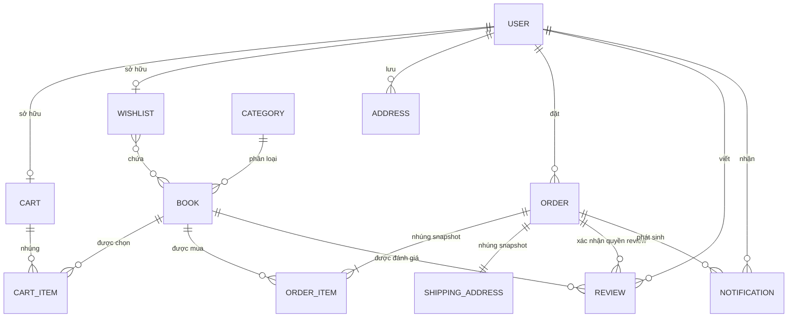
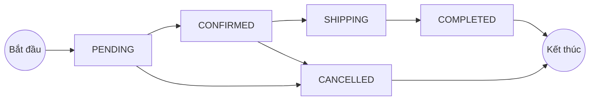

# Lược đồ dữ liệu BookStore

> Trạng thái tài liệu: **as-is**, đối chiếu từ source ngày **2026-07-17**. Khi tài liệu và code khác nhau, schema, DTO và service trong code là nguồn sự thật cuối cùng.

Tài liệu này mô tả dữ liệu MongoDB của `backend-for-react-ts` và cách dữ liệu đó được sử dụng bởi `01-react-vite-starter`. Phạm vi gồm cấu trúc document, quan hệ, dữ liệu nhúng, enum, index, quy tắc đồng bộ và các điểm lệch contract hiện có. Kiến trúc tổng thể được trình bày riêng trong [ARCHITECTURE.md](./ARCHITECTURE.md).

## 1. Cách đọc tài liệu

- **Bắt buộc ở DB** nghĩa là field có `required: true` trong Mongoose schema.
- **Bắt buộc ở API** nghĩa là DTO tạo mới có validation bắt buộc. Một field có thể bắt buộc ở API nhưng chưa bắt buộc ở DB.
- **Tham chiếu** là `ObjectId` có `ref`; MongoDB không tự kiểm tra khóa ngoại và không tự cascade khi xóa.
- **Nhúng** là subdocument nằm bên trong document cha và không có collection riêng.
- **Snapshot** là bản sao tại một thời điểm, được giữ ổn định dù dữ liệu nguồn thay đổi sau đó.
- **Tổng hợp** là field được service tính từ dữ liệu khác; không nên sửa trực tiếp.
- Trong JSON trả về API, `ObjectId` và `Date` lần lượt được serialize thành chuỗi ID và chuỗi thời gian ISO 8601.

Tên collection không được cấu hình tường minh trong schema. Bảng dưới dùng tên mặc định theo quy ước pluralize của Mongoose.

## 2. Tổng quan mô hình

| Model | Collection dự kiến | Kiểu lưu trữ | Vai trò |
| --- | --- | --- | --- |
| `User` | `users` | Document | Tài khoản, hồ sơ, xác thực và phân quyền |
| `Category` | `categories` | Document | Danh mục và slug |
| `Book` | `books` | Document | Catalog, giá, tồn kho và thống kê rating |
| `Cart` | `carts` | Document + `CartItem[]` nhúng | Một giỏ hàng cho mỗi user |
| `Wishlist` | `wishlists` | Document | Một danh sách yêu thích cho mỗi user |
| `Address` | `addresses` | Document | Sổ địa chỉ giao hàng của user |
| `Order` | `orders` | Document + item/address nhúng | Đơn hàng và snapshot tại lúc checkout |
| `Review` | `reviews` | Document + media nhúng | Đánh giá gắn với đơn đã hoàn thành |
| `Notification` | `notifications` | Document | Thông báo bền vững cho user |

Các module `history`, `dashboard` và `payments` không có collection riêng: chúng truy vấn hoặc cập nhật `orders`, `books` và `users`. `locations` đọc dữ liệu tỉnh/phường đóng gói trong source; file media được lưu ở Cloudinary. Backend hiện không có model hay collection voucher.



## 3. Quy ước dùng chung

### 3.1 ID, thời gian và soft delete

Mongoose tự tạo `_id: ObjectId`. Tất cả chín schema chính đều bật `timestamps: true`, nên có `createdAt` và `updatedAt` do Mongoose quản lý.

`mongoose-delete` được đăng ký ở cấp connection với `deletedAt`, `deletedBy` và `overrideMethods`. Vì vậy các model còn nhận metadata do plugin quản lý:

| Field | Kiểu | Ý nghĩa |
| --- | --- | --- |
| `deleted` | `boolean` | Đánh dấu document đã soft delete |
| `deletedAt` | `Date` | Thời điểm soft delete |
| `deletedBy` | ID do plugin quản lý | User thực hiện xóa khi service truyền ID vào |

Các query chuẩn như `find`, `findOne`, `findById` và `countDocuments` được plugin override để mặc định bỏ qua document đã xóa. Muốn truy cập dữ liệu đã xóa phải dùng các method như `findDeleted` hoặc `findOneDeleted`.

> `unique` vẫn áp dụng với document đã soft delete vì unique index thuộc MongoDB, không phụ thuộc bộ lọc query của plugin. Category xử lý trường hợp này bằng cách kiểm tra cả bản ghi active và deleted trước khi tạo, sửa hoặc restore.

### 3.2 Audit actor

Một số model lưu actor theo dạng object nhúng:

```ts
{
  _id: ObjectId;
  email: string;
}
```

`createdBy` và `updatedBy` là snapshot nhận diện người thao tác, không phải Mongoose reference và không được populate. Chúng hiện có ở `User`, `Category`, `Book`, `Address`, `Order` và `Review`; không có ở `Cart`, `Wishlist` và `Notification`.

### 3.3 Reference, populate và response

Kiểu lưu trong MongoDB không phải lúc nào cũng giống kiểu frontend nhận được:

| Đường dẫn | Lưu trong DB | Dạng response thường gặp |
| --- | --- | --- |
| `Book.category` | `ObjectId` | `{ _id, name, slug }` sau populate |
| `Cart.items[].bookId` | `ObjectId` | `{ _id, mainText, thumbnail, price, quantity }` |
| `Wishlist.bookIds[]` | `ObjectId[]` | Mảng book đã populate |
| `Order.userId` | `ObjectId` | Admin có thể nhận `{ _id, fullName, email }` |
| `Review.userId` | `ObjectId` | `{ _id, fullName, email, avatar }` |
| `Review.orderId` | `ObjectId` | `{ _id, orderCode, createdAt }` |

Frontend cần chấp nhận cả ID và object đã populate ở những endpoint có response khác nhau. Populate không thay đổi dữ liệu được lưu.

## 4. Chi tiết từng collection

### 4.1 `User`

| Field | Kiểu | Mặc định/ràng buộc hiện tại | Ý nghĩa |
| --- | --- | --- | --- |
| `_id` | `ObjectId` | Tự sinh | ID user |
| `fullName` | `string` | API tạo mới bắt buộc; DB chưa `required` | Họ tên hiển thị |
| `email` | `string` | API kiểm tra email; chưa có unique index | Email đăng nhập |
| `phone` | `number` trong schema | API tạo mới bắt buộc | Số điện thoại; có lệch kiểu với frontend |
| `password` | `string` | DB chưa `required` | Hash mật khẩu, không phải mật khẩu thô |
| `role` | `USER \| ADMIN` | Mặc định `USER` | Vai trò hệ thống |
| `avatar` | `string` | Mặc định `default-user.png` | URL/tên ảnh đại diện |
| `isActive` | `boolean` | Mặc định `false` | Tài khoản đã được kích hoạt |
| `accountType` | `LOCAL \| GOOGLE` | Mặc định `LOCAL` | Nguồn xác thực |
| `codeId` | `string` | Tùy chọn | Mã xác thực email |
| `codeExpired` | `Date` | Tùy chọn | Hạn dùng mã xác thực |
| `passwordResetToken` | `string` | Tùy chọn | Token/mã reset mật khẩu |
| `passwordResetExpired` | `Date` | Tùy chọn | Hạn dùng mã reset |
| `passwordChangeAt` | `Date` | Tùy chọn | Mốc thay đổi mật khẩu |
| `hashedRefreshToken` | `string` | Tùy chọn | Hash refresh token hiện hành |
| `tokenVersion` | `number` | Mặc định `0` | Vô hiệu hóa các JWT cũ khi tăng version |
| `createdBy`, `updatedBy` | Audit actor | Tùy chọn | Người tạo/cập nhật |
| `createdAt`, `updatedAt` | `Date` | Tự động | Thời gian tạo/cập nhật |

Các field xác thực (`password`, mã xác thực/reset, `hashedRefreshToken`, `tokenVersion`) là dữ liệu nhạy cảm. Response user được serialize bằng DTO và không nên trả các field này ra client.

Quy tắc service đáng chú ý:

- Tài khoản đăng ký local bắt đầu với `isActive: false`; admin tạo user thì service đặt `isActive: true`.
- Service kiểm tra email trùng trước khi tạo, nhưng DB chưa có unique index nên hai request đồng thời vẫn có thể tạo trùng.
- Thay đổi hoặc reset mật khẩu và logout dùng `tokenVersion`/refresh-token hash để vô hiệu hóa phiên cũ.

### 4.2 `Category`

| Field | Kiểu | Mặc định/ràng buộc hiện tại | Ý nghĩa |
| --- | --- | --- | --- |
| `_id` | `ObjectId` | Tự sinh | ID danh mục |
| `name` | `string` | Trim; API bắt buộc | Tên hiển thị |
| `slug` | `string` | Unique, trim, lowercase | Khóa URL ổn định |
| `description` | `string` | Mặc định `''`, trim | Mô tả |
| `createdBy`, `updatedBy` | Audit actor | Tùy chọn | Người thao tác |
| `createdAt`, `updatedAt` | `Date` | Tự động | Thời gian |

`CategoriesService` sinh slug từ `slug` do client gửi hoặc từ `name`: chuyển chữ thường, bỏ dấu tiếng Việt, bỏ ký tự đặc biệt và nối từ bằng dấu `-`. Service kiểm tra trùng slug trên cả dữ liệu active lẫn soft-deleted.

### 4.3 `Book`

| Field | Kiểu | Mặc định/ràng buộc hiện tại | Ý nghĩa |
| --- | --- | --- | --- |
| `_id` | `ObjectId` | Tự sinh | ID sách |
| `thumbnail` | `string` | API bắt buộc | Ảnh đại diện |
| `slider` | `string[]` | API yêu cầu ít nhất một phần tử | Các ảnh phụ |
| `mainText` | `string` | API bắt buộc | Tên sách |
| `author` | `string` | API bắt buộc | Tác giả |
| `price` | `number` | API yêu cầu `>= 0` | Giá hiện tại |
| `quantity` | `number` | API yêu cầu `>= 0` | Tồn kho hiện tại |
| `sold` | `number` | Mặc định `0` | Tổng số lượng đã bán, trừ lại khi hủy đơn |
| `category` | `ObjectId -> Category` | API bắt buộc và phải là MongoId | Danh mục |
| `averageRating` | `number` | Mặc định `0`, tổng hợp | Rating trung bình, làm tròn một chữ số |
| `reviewCount` | `number` | Mặc định `0`, tổng hợp | Số review chưa soft delete |
| `ratingSummary` | Object `{1..5: number}` | Mỗi mức mặc định `0`, tổng hợp | Phân bố rating |
| `createdBy`, `updatedBy` | Audit actor | Tùy chọn | Người thao tác |
| `createdAt`, `updatedAt` | `Date` | Tự động | Thời gian |

`quantity` và `sold` được cập nhật nguyên tử trong transaction checkout. Khi đơn bị hủy, service cộng lại `quantity` và trừ `sold`. Ba field rating chỉ là bản tổng hợp từ `reviews`; mọi create/update/delete review đều phải gọi luồng tính lại.

> Các ràng buộc `price >= 0`, `quantity >= 0` hiện nằm ở DTO, chưa nằm trong Mongoose schema. Ghi trực tiếp vào MongoDB hoặc dùng code bỏ qua DTO có thể tạo dữ liệu không hợp lệ.

### 4.4 `Cart` và `CartItem`

#### Document `Cart`

| Field | Kiểu | Mặc định/ràng buộc hiện tại | Ý nghĩa |
| --- | --- | --- | --- |
| `_id` | `ObjectId` | Tự sinh | ID giỏ hàng |
| `userId` | `ObjectId -> User` | Bắt buộc, unique | Một cart cho mỗi user |
| `items` | `CartItem[]` nhúng | Mặc định `[]` | Các sách trong giỏ |
| `totalItems` | `number` | Mặc định `0`, tổng hợp | Tổng `items[].quantity` |
| `totalPrice` | `number` | Mặc định `0`, tổng hợp | Tổng `quantity * priceAtAdd` |
| `createdAt`, `updatedAt` | `Date` | Tự động | Thời gian |

#### Subdocument `CartItem`

`CartItem` dùng `{ _id: false }`, vì vậy mỗi item không có ID riêng.

| Field | Kiểu | Ràng buộc | Ý nghĩa |
| --- | --- | --- | --- |
| `bookId` | `ObjectId -> Book` | Bắt buộc | Sách được chọn |
| `quantity` | `number` | Bắt buộc, số nguyên ở DTO, `>= 1` | Số lượng muốn mua |
| `priceAtAdd` | `number` | Bắt buộc | Snapshot giá lúc sách lần đầu được thêm |

Các bất biến được `CartsService` duy trì:

```text
totalItems = Σ item.quantity
totalPrice = Σ (item.quantity × item.priceAtAdd)
```

- Thêm lại cùng một sách sẽ cộng dồn quantity và giữ `priceAtAdd` cũ.
- Quantity không được vượt tồn kho hiện tại.
- Muốn xóa item phải dùng luồng xóa; update quantity không chấp nhận `0`.
- Checkout có thể lấy toàn bộ cart hoặc tập `selectedBookIds`, sau đó tính lại totals của phần còn lại trong transaction.

### 4.5 `Wishlist`

| Field | Kiểu | Mặc định/ràng buộc hiện tại | Ý nghĩa |
| --- | --- | --- | --- |
| `_id` | `ObjectId` | Tự sinh | ID wishlist |
| `userId` | `ObjectId -> User` | Bắt buộc, unique, index | Một wishlist cho mỗi user |
| `bookIds` | `ObjectId[] -> Book` | Mặc định `[]` | Các sách yêu thích |
| `createdAt`, `updatedAt` | `Date` | Tự động | Thời gian |

Service dùng `$addToSet`, nên cùng một `bookId` không bị thêm lặp. `totalItems` trong response là số sách populate còn tồn tại, **không phải field lưu trong MongoDB**. Các reference populate thành `null` được lọc khỏi response nhưng ID cũ chưa được dọn khỏi mảng trong DB.

### 4.6 `Address`

| Field | Kiểu | Mặc định/ràng buộc hiện tại | Ý nghĩa |
| --- | --- | --- | --- |
| `_id` | `ObjectId` | Tự sinh | ID địa chỉ |
| `userId` | `ObjectId -> User` | Bắt buộc, index | Chủ sở hữu |
| `fullName` | `string` | Bắt buộc, trim | Người nhận |
| `phone` | `string` | Bắt buộc, trim; DTO yêu cầu đúng 10 chữ số | Điện thoại người nhận |
| `provinceCode` | `string` | Bắt buộc, trim | Mã tỉnh/thành |
| `provinceName` | `string` | Bắt buộc, trim, materialized | Tên tỉnh tại lúc lưu |
| `wardCode` | `string` | Bắt buộc, trim | Mã phường/xã |
| `wardName` | `string` | Bắt buộc, trim, materialized | Tên phường/xã tại lúc lưu |
| `addressLine` | `string` | Bắt buộc, trim | Số nhà/đường |
| `fullAddress` | `string` | Bắt buộc, trim, tổng hợp | `addressLine, wardName, provinceName` |
| `isDefault` | `boolean` | Mặc định `false`, index | Địa chỉ mặc định |
| `createdBy`, `updatedBy` | Audit actor | Tùy chọn | Người thao tác |
| `createdAt`, `updatedAt` | `Date` | Tự động | Thời gian |

Service xác minh cặp `provinceCode`/`wardCode` bằng bộ dữ liệu location trong source rồi tự điền tên và `fullAddress`; client không được coi các field tên là nguồn sự thật đầu vào.

Quy tắc địa chỉ mặc định:

- Địa chỉ đầu tiên của user luôn là mặc định.
- Khi chọn một địa chỉ mặc định, service đặt các địa chỉ còn lại thành `false`.
- Nếu xóa địa chỉ mặc định, địa chỉ được cập nhật/tạo gần nhất còn lại sẽ được chọn.
- Quy tắc “tối đa một địa chỉ mặc định” hiện do service đảm bảo, chưa có partial unique index và chưa chạy trong transaction.

### 4.7 `Order`, `OrderItem` và `ShippingAddress`

#### Document `Order`

| Field | Kiểu | Mặc định/ràng buộc hiện tại | Ý nghĩa |
| --- | --- | --- | --- |
| `_id` | `ObjectId` | Tự sinh | ID đơn hàng |
| `orderCode` | `string` | Bắt buộc, unique, index | Mã dạng `ORD-YYYYMMDD-...` |
| `userId` | `ObjectId -> User` | Bắt buộc, index | Người đặt |
| `items` | `OrderItem[]` nhúng | Bắt buộc, mặc định `[]` | Snapshot sản phẩm |
| `shippingAddress` | `ShippingAddress` nhúng | Bắt buộc | Snapshot địa chỉ giao hàng |
| `totalPrice` | `number` | Service tự tính | Tổng tiền trước khi có hỗ trợ voucher |
| `status` | `OrderStatus` | Mặc định `PENDING` | Trạng thái giao hàng |
| `paymentMethod` | `COD \| VNPAY` | Bắt buộc | Phương thức thanh toán |
| `paymentStatus` | `UNPAID \| PAID \| REFUNDED` | Mặc định `UNPAID` | Trạng thái thanh toán |
| `note` | `string` | Tùy chọn | Ghi chú của khách |
| `createdBy`, `updatedBy` | Audit actor | Tùy chọn | Actor; checkout hiện không gán `createdBy` |
| `createdAt`, `updatedAt` | `Date` | Tự động | Thời gian |

#### Subdocument `OrderItem`

`OrderItem` dùng `{ _id: false }`.

| Field | Kiểu | Ràng buộc | Ý nghĩa |
| --- | --- | --- | --- |
| `bookId` | `ObjectId -> Book` | Bắt buộc | Liên kết về sách |
| `bookName` | `string` | Bắt buộc | Snapshot tên sách |
| `thumbnail` | `string` | Tùy chọn | Snapshot ảnh |
| `quantity` | `number` | Bắt buộc, `>= 1` | Số lượng mua |
| `price` | `number` | Bắt buộc, `>= 0` | Snapshot từ `CartItem.priceAtAdd` |

#### Subdocument `ShippingAddress`

`ShippingAddress` dùng `{ _id: false }` và gồm ba chuỗi bắt buộc: `fullName`, `phone`, `address`. Đây là snapshot độc lập với collection `addresses`; sửa hoặc xóa địa chỉ đã lưu không làm thay đổi đơn cũ.

```json
{
  "orderCode": "ORD-20260717-8A1B2C3D4E5F",
  "userId": "<userObjectId>",
  "items": [
    {
      "bookId": "<bookObjectId>",
      "bookName": "Nhà giả kim",
      "thumbnail": "https://.../book.jpg",
      "quantity": 2,
      "price": 89000
    }
  ],
  "shippingAddress": {
    "fullName": "Nguyễn Văn An",
    "phone": "0901234567",
    "address": "12 Nguyễn Văn Bảo, Phường Hạnh Thông, TP. Hồ Chí Minh"
  },
  "totalPrice": 178000,
  "status": "PENDING",
  "paymentMethod": "COD",
  "paymentStatus": "UNPAID"
}
```

Vòng đời trạng thái hợp lệ:



- User chỉ tự hủy được đơn `PENDING`.
- Hủy từ `PENDING` hoặc `CONFIRMED` sẽ hoàn `Book.quantity` và giảm `Book.sold` trong transaction.
- Khi đơn COD chuyển sang `COMPLETED`, service tự chuyển `paymentStatus` từ `UNPAID` sang `PAID`.
- VNPay đánh dấu `PAID` theo cách idempotent sau khi kiểm tra chữ ký, mã đơn và số tiền.
- `REFUNDED` có trong enum nhưng source hiện chưa có luồng nghiệp vụ cập nhật sang trạng thái này.

### 4.8 `Review` và `ReviewMedia`

| Field | Kiểu | Mặc định/ràng buộc hiện tại | Ý nghĩa |
| --- | --- | --- | --- |
| `_id` | `ObjectId` | Tự sinh | ID review |
| `userId` | `ObjectId -> User` | Bắt buộc, index | Người viết |
| `bookId` | `ObjectId -> Book` | Bắt buộc, index | Sách được đánh giá |
| `orderId` | `ObjectId -> Order` | Bắt buộc, index | Đơn chứng minh đã mua |
| `rating` | `number` | Bắt buộc, số nguyên `1..5` | Số sao |
| `comment` | `string` | Trim, tối đa 1500 ký tự | Bình luận tùy chọn |
| `media` | `ReviewMedia[]` nhúng | Mặc định `[]` | Ảnh/video đính kèm |
| `helpfulBy` | `ObjectId[] -> User` | Mặc định `[]` | User đánh dấu hữu ích |
| `createdBy`, `updatedBy` | Audit actor | Tùy chọn | Người thao tác |
| `createdAt`, `updatedAt` | `Date` | Tự động | Thời gian |

`ReviewMedia` không có `_id`, gồm:

| Field | Kiểu | Ràng buộc |
| --- | --- | --- |
| `url` | `string` | Bắt buộc |
| `publicId` | `string` | Tùy chọn, dùng với Cloudinary |
| `type` | `IMAGE \| VIDEO` | Mặc định ở schema là `IMAGE`; DTO yêu cầu gửi enum |

Quy tắc nghiệp vụ:

- Chỉ được review sách thuộc một order `COMPLETED` của chính user.
- `orderId` tùy chọn ở create DTO; nếu không gửi, service chọn order hoàn thành mới nhất chưa được review cho sách đó. Giá trị lưu trong DB vẫn luôn bắt buộc.
- Mỗi bộ `(userId, bookId, orderId)` chỉ được review một lần theo kiểm tra của service.
- `helpfulBy` được toggle bằng `$addToSet`/`$pull`, nên một user xuất hiện tối đa một lần trong luồng chuẩn.
- Sau create, update hoặc soft delete review, service aggregate các review chưa xóa và ghi lại `Book.averageRating`, `Book.reviewCount`, `Book.ratingSummary`.

> Schema hiện chưa khai báo compound unique index cho `(userId, bookId, orderId)`. Kiểm tra “một review cho mỗi sách trong mỗi đơn” có khe hở race condition nếu hai request tạo đồng thời.

### 4.9 `Notification`

| Field | Kiểu | Mặc định/ràng buộc hiện tại | Ý nghĩa |
| --- | --- | --- | --- |
| `_id` | `ObjectId` | Tự sinh | ID thông báo |
| `userId` | `ObjectId -> User` | Bắt buộc, index | Người nhận |
| `title` | `string` | Bắt buộc | Tiêu đề |
| `message` | `string` | Bắt buộc | Nội dung |
| `type` | `ORDER_STATUS \| PAYMENT_SUCCESS` | Bắt buộc | Loại sự kiện |
| `orderId` | `ObjectId -> Order` | Tùy chọn | Đơn liên quan |
| `orderCode` | `string` | Tùy chọn | Snapshot mã đơn để hiển thị |
| `isRead` | `boolean` | Mặc định `false`, index | Đã đọc hay chưa |
| `readAt` | `Date` | Tùy chọn | Thời điểm chuyển sang đã đọc |
| `createdAt`, `updatedAt` | `Date` | Tự động | Thời gian |

Notification được tạo từ BullMQ processor sau thay đổi trạng thái đơn hoặc thanh toán thành công. Socket.IO chỉ phát tín hiệu realtime; collection này mới là nguồn dữ liệu bền vững để tải lại danh sách và unread count.

## 5. Bất biến và ranh giới transaction

| Luồng | Dữ liệu phải đồng bộ | Cơ chế hiện tại |
| --- | --- | --- |
| Thêm/sửa/xóa cart item | `items`, `totalItems`, `totalPrice` | Atomic update hoặc `save`; không dùng transaction |
| Checkout | `Book.quantity`, `Book.sold`, `Order`, phần cart còn lại | Một MongoDB transaction nhiều document |
| Hủy order | `Order.status`, tồn kho và số đã bán | Một MongoDB transaction |
| Thanh toán VNPay | `Order.paymentStatus` | Conditional update idempotent |
| Create/update/delete review | `Review` và ba field rating trong `Book` | Hai bước, chưa nằm trong cùng transaction |
| Đổi địa chỉ mặc định | Nhiều `Address.isDefault` | Nhiều update, chưa có transaction/unique constraint |
| Thêm wishlist | `Wishlist.bookIds` không trùng | `$addToSet` |

Checkout cần MongoDB replica set hoặc MongoDB Atlas vì transaction nhiều document không chạy trên MongoDB standalone.

Thứ tự tin cậy khi đọc dữ liệu:

1. Lịch sử đơn dùng snapshot `Order.items`, `Order.shippingAddress` và `Order.totalPrice`.
2. Catalog hiện tại dùng `Book` và `Category` đã populate.
3. Giá giỏ hàng dùng `CartItem.priceAtAdd`, không tự thay bằng `Book.price` khi đọc.
4. Thống kê rating hiển thị nhanh từ `Book`, nhưng có thể tái tạo từ các `Review` chưa soft delete.
5. `Wishlist.totalItems` là field response được tính lúc đọc, không phải dữ liệu lưu.

## 6. Index hiện có

Bảng này chỉ liệt kê index được khai báo trực tiếp trong source, ngoài `_id` mặc định.

| Model | Index | Loại/mục đích |
| --- | --- | --- |
| `Category` | `{ slug: 1 }` | Unique |
| `Cart` | `{ userId: 1 }` | Unique |
| `Order` | `{ orderCode: 1 }` | Unique/index |
| `Order` | `{ userId: 1 }` | Index |
| `Review` | `{ userId: 1 }` | Index |
| `Review` | `{ bookId: 1 }` | Index |
| `Review` | `{ orderId: 1 }` | Index |
| `Address` | `{ userId: 1 }` | Index |
| `Address` | `{ isDefault: 1 }` | Index |
| `Address` | `{ userId: 1, createdAt: -1 }` | Compound index |
| `Address` | `{ userId: 1, isDefault: 1 }` | Compound index |
| `Address` | `{ provinceCode: 1, wardCode: 1 }` | Compound index |
| `Wishlist` | `{ userId: 1 }` | Unique/index |
| `Notification` | `{ userId: 1 }` | Index |
| `Notification` | `{ isRead: 1 }` | Index |

`User` và `Book` chưa khai báo index nghiệp vụ. Trước khi tăng tải hoặc coi dữ liệu là production-ready, nên đánh giá ít nhất các khoảng trống sau:

| Nhu cầu | Constraint/index nên cân nhắc | Lý do |
| --- | --- | --- |
| Email không trùng | Unique index cho email đã normalize | Service check không chống được request đồng thời |
| Một review cho mỗi sách trong mỗi đơn | Unique `{ userId, bookId, orderId }` | Khớp quy tắc service và loại race condition |
| Tối đa một địa chỉ mặc định/user | Partial unique index theo `userId` khi `isDefault: true` | Bảo vệ bất biến ở DB |
| Danh sách notification mới/chưa đọc | Compound `{ userId, isRead, createdAt: -1 }` | Khớp filter + sort thường dùng |
| Review theo sách | Compound theo `bookId`, filter và sort thực tế | Giảm sort/scan khi dữ liệu lớn |
| Catalog theo category/giá/ngày | Index theo query production đo được | `Book` hiện chưa có index ngoài `_id` |

> `unique: true` tạo unique index; nó không phải validator thân thiện ở tầng Mongoose. Việc thêm unique index vào collection đã có dữ liệu phải kiểm tra và xử lý duplicate trước khi rollout.

## 7. Đối chiếu contract với React

Frontend khai báo type riêng trong `src/types/global.d.ts`, không sinh tự động từ backend. Các điểm sau cần được hiểu rõ khi dùng schema hoặc thay đổi API.

| Chủ đề | Backend hiện tại | Frontend hiện tại | Hệ quả |
| --- | --- | --- | --- |
| `User.phone` | Schema/response DTO dùng `number`; update DTO dùng `string` | `IUser.phone` và API create/update dùng `string` | Contract không thống nhất; số `0` đầu có thể mất nếu lưu dạng number |
| Voucher | Không có module/schema; `CheckoutDto` không có `voucherCode` | Có API `/vouchers/*`, `voucherCode`, `originalPrice`, `discount` | Chức năng chưa có nguồn dữ liệu backend; payload checkout có field lạ sẽ bị validation từ chối |
| Order giảm giá | Chỉ có `totalPrice` | `IOrder` còn đọc `originalPrice`, `discount`, `voucherCode` | Ba field này không được persist/trả bởi backend hiện tại |
| Wishlist timestamps | Schema có timestamps | `IWishlist` yêu cầu `createdAt`, `updatedAt`, nhưng service tự dựng response không trả hai field | Type rộng hơn response thực tế |
| Address book | Backend có CRUD `/addresses` và collection riêng | `services/api.ts` chưa có facade/type address; checkout tự tạo shipping snapshot | Sổ địa chỉ backend chưa được nối vào UI hiện tại |
| Review `orderId` | Persist bắt buộc; service có thể tự chọn order | Create type cho phép bỏ `orderId` | Đây là chủ ý của API, không phải field tùy chọn trong DB |
| Populate | DB lưu `ObjectId` | Nhiều type dùng object đầy đủ | Cần giữ serializer/populate và frontend type đồng bộ theo từng endpoint |

Global validation của backend bật `whitelist`, `forbidNonWhitelisted` và `transform`. Do đó thêm field chỉ ở frontend chưa đủ: DTO backend phải chấp nhận field trước khi request có thể đi qua controller.

## 8. Quy tắc an toàn khi thay đổi schema

Khi thêm hoặc sửa một field, nên cập nhật theo thứ tự sau:

1. Xác định field là dữ liệu nguồn, snapshot, tổng hợp hay chỉ là response-derived.
2. Sửa Mongoose schema và quyết định `required`, default, enum, min/max, trim và index.
3. Sửa create/update/query DTO; không dựa riêng vào validation của frontend.
4. Sửa service để giữ các bất biến, transaction và cache invalidation liên quan.
5. Sửa response DTO để không lộ field nhạy cảm.
6. Sửa type, API facade và UI trong React.
7. Chuẩn bị migration/backfill trước khi bật `required` hoặc unique index trên dữ liệu cũ.
8. Kiểm tra hành vi với document soft-deleted và reference trỏ tới document đã xóa.
9. Cập nhật tài liệu này và test cho create/read/update/delete, concurrency và rollback theo [TESTING.md](./TESTING.md).

Không sửa trực tiếp các field sau nếu không đồng thời cập nhật dữ liệu nguồn:

- `Cart.totalItems`, `Cart.totalPrice`;
- `Book.quantity`, `Book.sold` ngoài luồng inventory/order;
- `Book.averageRating`, `Book.reviewCount`, `Book.ratingSummary`;
- `Address.provinceName`, `Address.wardName`, `Address.fullAddress`;
- snapshot trong order sau khi đơn đã được tạo.

## 9. Nguồn sự thật trong code

### Backend

- Schema: `src/modules/*/schemas/*.schema.ts`.
- Soft delete toàn cục: `src/app.module.ts`.
- DTO request: `src/modules/*/dto/*.ts`.
- Cart totals: `src/modules/carts/carts.service.ts`.
- Checkout, inventory và order lifecycle: `src/modules/orders/orders.service.ts`.
- VNPay/payment status: `src/modules/payments/payments.service.ts`.
- Review và rating aggregate: `src/modules/reviews/reviews.service.ts`.
- Địa chỉ mặc định/materialized address: `src/modules/addresses/addresses.service.ts`.
- Wishlist response-derived fields: `src/modules/wishlists/wishlists.service.ts`.
- Notification/read state: `src/modules/notifications/notifications.service.ts`.

### Frontend

- Kiểu response/request: `01-react-vite-starter/src/types/global.d.ts`.
- API facade: `01-react-vite-starter/src/services/api.ts`.
- Dữ liệu checkout/shipping snapshot: `01-react-vite-starter/src/pages/client/checkout/checkout.page.tsx`.
